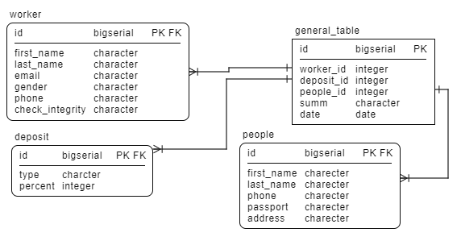
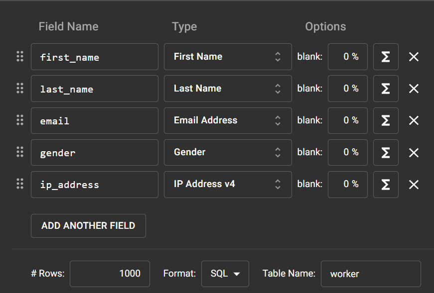

# Контрольная работа

---
## Лабораторная работа №1 
### Создание модели реляционной базы данных
**_Система банковских вкладов_**



---
## Лабораторная работа №2
### Создание сервера в postgresql
- Установил **Ubuntu** на **VirtualBox**
- В **Ubuntu** установил **postgresql**
- Создал в *postgresql* сервер **_'My_SQL_server'_**
- Далее для подключения к серверу с основной машины настроил **Firewall**

Добавления разрешения доступа для ip адресса
>sudo ufw allow from <ip_address>

Проверка состояния UFW
>sudo ufw status verbose

Подключился к виртуальной машине через ssh
> ssh ammin@192.168.1.1

Подключился к системе управлинием базами данных
> sudo -i -u postgres

---
## Лабораторная работа №3
### Создание базы данных, таблиц и связей между ними 
**Создание таблицы deposit**
```
CREATE TABLE deposit
(
	id SERIAL PRIMARY KEY,
	type VARCHAR(100) NOT NULL,
	percent INTEGER NOT NULL
);
```
**Создание таблицы people**
```
CREATE TABLE people
(
	id SERIAL PRIMARY KEY,
	first_name VARCHAR(50)NOT NULL,
	last_name VARCHAR(50)NOT NULL,
	phone VARCHAR(50)NOT NULL,
	passport_num VARCHAR(50)NOT NULL,
	address VARCHAR(50)NOT NULL
);
```
**Создание таблицы worker**
```
CREATE TABLE worker
(
	id SERIAL PRIMARY KEY,
	first_name VARCHAR(50)NOT NULL,
	last_name VARCHAR(50)NOT NULL,
	email VARCHAR(50)NOT NULL,
	gender VARCHAR(50)NOT NULL,
	phone VARCHAR(50)NOT NULL,	
	check_integrity INT NOT NULL
);
```
**Создание таблицы general_table c Foreign Key**
```
CREATE TABLE general_table
(
	id SERIAL PRIMARY KEY,
	worker_id INTEGER REFERENCES worker(id),
  	people_id INTEGER REFERENCES people(id),
  	deposit_id INTEGER REFERENCES deposit(id),
	summ VARCHAR(20) NOT NULL,
  	date DATE NOT NULL  
);
```
**Создание таблицы test_table**
```
CREATE TABLE test_table
(
	id SERIAL PRIMARY KEY,	
	date DATE DEFAULT NOW()
);
```
**Удаление таблицы test_table**
```
DROP TABLE test_table;  
```
---
## Лабораторная работа №4
### Ввод и редактирование информации в базе данных

С помощью онлайн сервиса Mockaroo осуществил вставку данных в таблицы 

>Добавил в таблицы данные (пример добавления записей)
```
insert into general_table (worker_id, deposit_id, people_id, summ, date) values (52, 3, 213, '$6603479.96', '2016-11-04');
insert into general_table (worker_id, deposit_id, people_id, summ, date) values (43, 5, 297, '$4562305.31', '2018-06-19');
insert into general_table (worker_id, deposit_id, people_id, summ, date) values (8, 5, 187, '$5135928.33', '2020-02-10');
```
Обновление данных
```
UPDATE people SET last_name = 'Maks' WHERE id = 1;
UPDATE people SET last_name = 'Maksimka' WHERE id = 2;
```

---
## Лабораторная работа №5
### Создание простых запросов на выборку

Заброс на один столбец таблицы 
```
SELECT last_name FROM people;
```
Запрос на все столбцы таблицы
```
SELECT * FROM people;
```
Выборка двух колонок таблицы
```
SELECT last_name, address, phone  FROM people;
```

Проверка обновленных данных
```
SELECT id, last_name FROM people ORDER BY id
```
Выборка с условием и сортировкой 
```
SELECT * FROM worker Where gender = 'Male' ORDER BY first_name
```

Выборка с JOIN 
```
SELECT worker_id, worker.first_name, worker.last_name FROM general_table 
LEFT JOIN worker ON worker.id = general_table.worker_id 
```
Выборка с BETWEEN
```
SELECT * FROM people WHERE id between 10 and 20;
```
Выборка первых 10 записей
```
SELECT * FROM people LIMIT 10;
```
Выборка с Aliases
```
SELECT first_name AS name_people, phone AS num FROM people;
```

Выборка с LIKE 
```
SELECT email FROM worker WHERE email LIKE '%.com';
```

---
## Лабораторная работа №6
### Создание запросов с использованием агрегатных функций и группировки
Запрос с функциями MAX, MIN, COUNT
```
SELECT MIN(date) AS Дата_первого_вклада,  
MAX(date) AS Дата_последнего_вклада,
COUNT(date) AS Всего_вкладов
FROM general_table;

 Дата_первого_вклада | Дата_последнего_вклада | Всего_вкладов
---------------------|------------------------|---------------
 2015-05-16          | 2022-12-29             |          1901
```
Запрос с функцией COUNT
```
SELECT count(gender) FROM worker WHERE gender = 'Male';
| count|
--------
|  57  |
```
Запрос с сортировкой по first_name и выводом первых 10 записей
```
SELECT first_name, last_name, email FROM worker ORDER BY first_name LIMIT 10;

 first_name | last_name |            email
------------+-----------+-----------------------------
 123Maks    | Byrito    | tea@gmail.com
 Adda       | Sillis    | asillis4@biblegateway.com
 Addy       | Aujean    | aaujean24@prnewswire.com
 Aili       | Addey     | aaddeyn@cbsnews.com
 Alli       | Radeliffe | aradeliffee@google.nl
 Amino      | Talete    | karala@gmail.com
 Ariella    | Blasio    | ablasio1c@delicious.com
 Arne       | Nockalls  | anockalls9@businesswire.com
 Artyro     | Byrito    | coffe@gmail.com
 Aryn       | Proske    | aproske1k@cbsnews.com
```
---
## Лабораторная работа №7, 8, 9
### Создание представлений, функций и треггеров 
#### - Представление
Создать представление и просмотреть 
```
CREATE VIEW Worker_woman
AS SELECT * FROM worker
WHERE gender = 'Female';
```
Просмотр представления worker_woman
```
SELECT * FROM worker_woman LIMIT 10;
 id | first_name | last_name  |            email            | gender |        phone
----+------------+------------+-----------------------------+--------+---------------------
  4 | Florance   | Sutheran   | fsutheran3@i2i.jp           | Female | +58 (393) 566-4626
  6 | Erda       | Ferrara    | eferrara5@purevolume.com    | Female | +57 (496) 604-5784
  9 | Paulette   | McIlhone   | pmcilhone8@intel.com        | Female | +963 (112) 802-3406
 12 | Cami       | Shimmin    | cshimminb@utexas.edu        | Female | +55 (393) 460-1581
 15 | Alli       | Radeliffe  | aradeliffee@google.nl       | Female | +230 (292) 354-5306
 20 | Bianca     | Coolbear   | bcoolbearj@smh.com.au       | Female | +86 (354) 487-6945
 22 | Nanette    | Tettley    | ntettleyl@hao123.com        | Female | +33 (268) 765-6459
 24 | Aili       | Addey      | aaddeyn@cbsnews.com         | Female | +46 (280) 866-4718
 26 | Coralyn    | Warnock    | cwarnockp@howstuffworks.com | Female | +57 (281) 414-9011
 29 | Fifi       | Grahamslaw | fgrahamslaws@edublogs.org   | Female | +86 (478) 746-6590
(10 rows)
```
#### - Процедура
Создание процедуры
```
CREATE PROCEDURE Add_worker(
@name VARCHAR(100),
@surname VARCHAR(100),
@email_address VARCHAR(100),
@sex VARCHAR(10),
@phone VARCHAR(20)
)
INSERT INTO worker(first_name, last_name, email, gender, phone)
VALUES (@name, @surname, @email_address, @sex, @phone);
```

Применение процедуры 
```
CALL Add_worker('Maks', 'Daven', 'maks@gmail.com', 'Male', +79457892536);
```

#### - Функция
Создание функции
```
CREATE FUNCTION worker_sex (sex varchar (30))
RETURNS SETOF character AS 
$$     
     SELECT first_name FROM worker
         WHERE gender = $1
$$
LANGUAGE sql
```
Вызов функции 
```
SELECT worker_sex('Female') AS name;
____________________________________
name
-------------
 Florance
 Erda
 Paulette
 Cami
 Alli
 Bianca
 Nanette
...
(40 rows)
```
 
Создание функции
```
CREATE FUNCTION date_open_deposit(dates date)
RETURNS TABLE (summ varchar(30)) AS
$$
	SELECT summ FROM general_table WHERE date = $1
$$
LANGUAGE sql;
```
Вызов функции 
```
SELECT date_open_deposit('2021-02-17');

 date_open_deposit
-------------------
 $286590.92
 $795816.70
(2 rows)
```

#### - Триггеры и триггерные функции
Создание треггерной функции **new_worker_function**
```
CREATE OR REPLACE FUNCTION new_worker_function()
  RETURNS trigger AS $BODY$
BEGIN
  NEW.check_integrity := 1;  
  RETURN NEW;
END $BODY$
LANGUAGE plpgsql;
```
Создание триггера **new_worker_trigger**
```
CREATE TRIGGER new_worker_trigger
BEFORE UPDATE
ON worker
FOR EACH ROW
EXECUTE PROCEDURE new_worker_function();
```
***Проверка работы триггера***
```
SELECT * FROM worker WHERE id = 2;
 id | first_name  | last_name |  email   | gender |        phone        | check_integrity
----+-------------+-----------+----------+--------+---------------------+-----------------
  2 | Ulrikaumeko | Schlagh   | not mail | Female | +504 (776) 434-4512 |               0
(1 row)
```
```
UPDATE worker SET first_name = 'Helicopter' WHERE id = 2;
```
Обновил данные, сработал триггер и изменил значение поля check_integrity на 1
```
SELECT * FROM worker WHERE id = 2;
 id | first_name | last_name |  email   | gender |        phone        | check_integrity
----+------------+-----------+----------+--------+---------------------+-----------------
  2 | Helicopter | Schlagh   | not mail | Female | +504 (776) 434-4512 |               1
(1 row)
```

Создание треггерной функции **history_function**
```
CREATE OR REPLACE FUNCTION history_function()
  RETURNS trigger AS $BODY$
BEGIN
    INSERT INTO history (date_append, id_worker) VALUES (NOW(), NEW.id);
	RETURN NEW;
END $BODY$
LANGUAGE plpgsql;
```
Создание триггера **history_trigger**
```
CREATE TRIGGER history_trigger
AFTER INSERT
ON worker
FOR EACH ROW
EXECUTE PROCEDURE history_function();
```
Вставка данных в таблицу **worker**
```
INSERT INTO worker (first_name, last_name, email, gender, phone)
VALUES ('Gena', 'Bykin', 'gena@mail.ru', 'Male' , '+79206890102');
```
```
SELECT * FROM worker WHERE first_name = 'Gena';
 id  | first_name | last_name |    email     | gender |    phone     | check_integrity
-----+------------+-----------+--------------+--------+--------------+-----------------
 117 | Gena       | Bykin     | gena@mail.ru | Male   | +79206890102 |               0
(1 row)
```
Триггер history_trigger добавил запись в таблицу history
```
SELECT * FROM history;
 id | date_append | id_worker
----+-------------+-----------
  1 | 2022-05-18  |       117
(1 row)
```

---
## Лабораторная работа №10
### Создание ролей. Права ролей
Просмотр текущей роли
```
SELECT session_user; -- session user name
 session_user
 ------------
 postgres
(1 row)
```

Создание роли **maks_test**, **maks_test** ни может вносить изменения в базу данных. Роль активна до 2023-09-23 | 20:03:42, лимит подключений отсутствует.
```
CREATE ROLE maks_test WITH
 LOGIN
 NOSUPERUSER
 NOCREATEDB
 NOCREATEROLE
 NOINHERIT
 NOREPLICATION
 CONNECTION LIMIT -1
 VALID UNTIL '2023-09-23T20:03:42+03:00'
 PASSWORD '123';
```
Просмотрел список ролей.
```
\du                                    List of roles
  Role name  |                         Attributes                         | Member of
-------------+------------------------------------------------------------+-----------
 hidden_user | Cannot login                                               | {}
 maks_test   | No inheritance                                            +| {}
             | Password valid until 2023-09-23 20:03:42+03                |
 postgres    | Superuser, Create role, Create DB, Replication, Bypass RLS | {}
```

Создана роль **temporary_user** с правами входа, создания потоковой репликации и резервного копирования. Лимит подключений задан **20**
```
CREATE ROLE temporary_user WITH
	LOGIN
	NOSUPERUSER
	NOCREATEDB
	NOCREATEROLE
	INHERIT
	REPLICATION
	CONNECTION LIMIT 20
	PASSWORD '321';
```
Просмотрел список ролей.
```
\du
                                      List of roles
   Role name    |                         Attributes                         | Member of
----------------+------------------------------------------------------------+-----------
 hidden_user    | Cannot login                                               | {}
 maks_test      | No inheritance                                            +| {}
                | Password valid until 2023-09-23 20:03:42+03                |
 postgres       | Superuser, Create role, Create DB, Replication, Bypass RLS | {}
 temporary_user | Replication                                               +| {}
                | 20 connections                                             |
```
Изменил лимит подключения с 20 на 100
```
SYBD=# ALTER ROLE temporary_user WITH CONNECTION LIMIT 100;
ALTER ROLE
Time: 2,065 ms
```
```
\du     
                             List of roles
   Role name    |                         Attributes                         | Member of
----------------+------------------------------------------------------------+-----------
 hidden_user    | Cannot login                                               | {}
 maks_test      | No inheritance                                            +| {}
                | Password valid until 2023-09-23 20:03:42+03                |
 postgres       | Superuser, Create role, Create DB, Replication, Bypass RLS | {}
 temporary_user | Replication                                               +| {}
                | 100 connections                                            |
```
---
## Лабораторная работа №11
### Резервное копирование
База данных **SYBD**
```
SYBD=# \d
                  List of relations
 Schema |         Name         |   Type   |  Owner
--------+----------------------+----------+----------
 public | deposit              | table    | postgres
 public | deposit_id_seq       | sequence | postgres
 public | general_table        | table    | postgres
 public | general_table_id_seq | sequence | postgres
 public | people               | table    | postgres
 public | people_id_seq        | sequence | postgres
 public | worker               | table    | postgres
 public | worker_id_seq        | sequence | postgres
(8 rows)
```

Создание резервной копии базы данных **SYBD**
```
pg_dump -Fc -v --host=localhost --username=postgres --dbname=SYBD -f dumpSQL.dump
```
 
Импорт резервной копии dumpSQL.dump в базу данных **123**
```
pg_restore -v --no-owner --host=localhost --username=postgres --dbname=123 dumpSQL.dump
```
Импорт завершен успешно.
 ```
 123=# \d
                  List of relations
 Schema |         Name         |   Type   |  Owner
--------+----------------------+----------+----------
 public | deposit              | table    | postgres
 public | deposit_id_seq       | sequence | postgres
 public | general_table        | table    | postgres
 public | general_table_id_seq | sequence | postgres
 public | people               | table    | postgres
 public | people_id_seq        | sequence | postgres
 public | worker               | table    | postgres
 public | worker_id_seq        | sequence | postgres
(8 rows)
```
---
## Лабораторная работа №XX
### Индексы
Запрос без индексов
 ```
SYBD=# EXPLAIN SELECT * FROM people WHERE lower(first_name) = 'brig' AND lower(last_name) = 'maks';
                                              QUERY PLAN
------------------------------------------------------------------------------------------------------
 Seq Scan on people  (cost=0.00..20.00 rows=1 width=65)
   Filter: ((lower((first_name)::text) = 'brig'::text) AND (lower((last_name)::text) = 'maks'::text))
(2 rows)
 ```
Создан индекс **people_index_fio**
```
CREATE INDEX people_index_fio
ON people (lower(first_name), lower(last_name));
 ```

Запрос с индексом, в результате видно что для поиска использовался индекс  **people_index_fio**
 ```

SYBD=# EXPLAIN SELECT * FROM people WHERE lower(first_name) = 'brig' AND lower(last_name) = 'maks';
                                                QUERY PLAN
----------------------------------------------------------------------------------------------------------
 Index Scan using people_index_fio on people  (cost=0.28..8.29 rows=1 width=65)
   Index Cond: ((lower((first_name)::text) = 'brig'::text) AND (lower((last_name)::text) = 'maks'::text))
(2 rows)
 ```

---
Запрос без индексов
```
SYBD=# EXPLAIN SELECT * FROM people WHERE passport_num = '9019279859';
                       QUERY PLAN
--------------------------------------------------------
 Seq Scan on people  (cost=0.00..15.50 rows=1 width=65)
   Filter: ((passport_num)::text = '9019279859'::text)
(2 rows)
```
Создал индекс **people_index_passport_num**
```
SYBD=# CREATE INDEX people_index_passport_num
ON people (passport_num);
```
Запрос с индексом, в результате видно что для поиска использовался индекс  **people_index_passport_num**
```
SYBD=# EXPLAIN SELECT * FROM people WHERE passport_num = '9019279859';
                                       QUERY PLAN
-----------------------------------------------------------------------------------------
 Index Scan using people_index_passport_num on people  (cost=0.28..8.29 rows=1 width=65)
   Index Cond: ((passport_num)::text = '9019279859'::text)
(2 rows)
```


